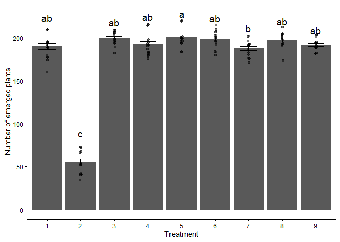

### 1. Read in the data called “PlantEmergence.csv” using a relative file path and load the following libraries. tidyverse, lme4, emmeans, multcomp, and multcompView. Turn the Treatment , DaysAfterPlanting and Rep into factors using the function as.factor

``` r
PlantEmergence <- read.csv("PlantEmergence.csv")

library(tidyverse)
```

    ## Warning: package 'ggplot2' was built under R version 4.5.1

    ## Warning: package 'tibble' was built under R version 4.5.1

    ## Warning: package 'stringr' was built under R version 4.5.2

    ## Warning: package 'forcats' was built under R version 4.5.1

    ## ── Attaching core tidyverse packages ──────────────────────── tidyverse 2.0.0 ──
    ## ✔ dplyr     1.1.4     ✔ readr     2.1.5
    ## ✔ forcats   1.0.1     ✔ stringr   1.6.0
    ## ✔ ggplot2   4.0.0     ✔ tibble    3.3.0
    ## ✔ lubridate 1.9.4     ✔ tidyr     1.3.1
    ## ✔ purrr     1.0.4     
    ## ── Conflicts ────────────────────────────────────────── tidyverse_conflicts() ──
    ## ✖ dplyr::filter() masks stats::filter()
    ## ✖ dplyr::lag()    masks stats::lag()
    ## ℹ Use the conflicted package (<http://conflicted.r-lib.org/>) to force all conflicts to become errors

``` r
library(lme4)
```

    ## Warning: package 'lme4' was built under R version 4.5.2

    ## Cargando paquete requerido: Matrix
    ## 
    ## Adjuntando el paquete: 'Matrix'
    ## 
    ## The following objects are masked from 'package:tidyr':
    ## 
    ##     expand, pack, unpack

``` r
library(emmeans)
```

    ## Warning: package 'emmeans' was built under R version 4.5.3

    ## Welcome to emmeans.
    ## Caution: You lose important information if you filter this package's results.
    ## See '? untidy'

``` r
library(multcomp)
```

    ## Warning: package 'multcomp' was built under R version 4.5.2

    ## Cargando paquete requerido: mvtnorm

    ## Warning: package 'mvtnorm' was built under R version 4.5.3

    ## Cargando paquete requerido: survival
    ## Cargando paquete requerido: TH.data

    ## Warning: package 'TH.data' was built under R version 4.5.2

    ## Cargando paquete requerido: MASS
    ## 
    ## Adjuntando el paquete: 'MASS'
    ## 
    ## The following object is masked from 'package:dplyr':
    ## 
    ##     select
    ## 
    ## 
    ## Adjuntando el paquete: 'TH.data'
    ## 
    ## The following object is masked from 'package:MASS':
    ## 
    ##     geyser

``` r
library(multcompView)
```

    ## Warning: package 'multcompView' was built under R version 4.5.3

``` r
cols <- c("Treatment", "DaysAfterPlanting", "Rep")
PlantEmergence[cols] <- lapply(PlantEmergence[cols], as.factor)
```

### 2. Fit a linear model to predict Emergence using Treatment and DaysAfterPlanting along with the interaction. Provide the summary of the linear model and ANOVA results.

``` r
lm_Emergence <- lm(Emergence ~ Treatment*DaysAfterPlanting, data = PlantEmergence)
summary(lm_Emergence)
```

    ## 
    ## Call:
    ## lm(formula = Emergence ~ Treatment * DaysAfterPlanting, data = PlantEmergence)
    ## 
    ## Residuals:
    ##     Min      1Q  Median      3Q     Max 
    ## -21.250  -6.062  -0.875   6.750  21.875 
    ## 
    ## Coefficients:
    ##                                  Estimate Std. Error t value Pr(>|t|)    
    ## (Intercept)                     1.823e+02  5.324e+00  34.229   <2e-16 ***
    ## Treatment2                     -1.365e+02  7.530e+00 -18.128   <2e-16 ***
    ## Treatment3                      1.112e+01  7.530e+00   1.477    0.142    
    ## Treatment4                      2.500e+00  7.530e+00   0.332    0.741    
    ## Treatment5                      8.750e+00  7.530e+00   1.162    0.248    
    ## Treatment6                      7.000e+00  7.530e+00   0.930    0.355    
    ## Treatment7                     -1.250e-01  7.530e+00  -0.017    0.987    
    ## Treatment8                      9.125e+00  7.530e+00   1.212    0.228    
    ## Treatment9                      2.375e+00  7.530e+00   0.315    0.753    
    ## DaysAfterPlanting14             1.000e+01  7.530e+00   1.328    0.187    
    ## DaysAfterPlanting21             1.062e+01  7.530e+00   1.411    0.161    
    ## DaysAfterPlanting28             1.100e+01  7.530e+00   1.461    0.147    
    ## Treatment2:DaysAfterPlanting14  1.625e+00  1.065e+01   0.153    0.879    
    ## Treatment3:DaysAfterPlanting14 -2.625e+00  1.065e+01  -0.247    0.806    
    ## Treatment4:DaysAfterPlanting14 -6.250e-01  1.065e+01  -0.059    0.953    
    ## Treatment5:DaysAfterPlanting14  2.500e+00  1.065e+01   0.235    0.815    
    ## Treatment6:DaysAfterPlanting14  1.000e+00  1.065e+01   0.094    0.925    
    ## Treatment7:DaysAfterPlanting14 -2.500e+00  1.065e+01  -0.235    0.815    
    ## Treatment8:DaysAfterPlanting14 -2.500e+00  1.065e+01  -0.235    0.815    
    ## Treatment9:DaysAfterPlanting14  6.250e-01  1.065e+01   0.059    0.953    
    ## Treatment2:DaysAfterPlanting21  3.500e+00  1.065e+01   0.329    0.743    
    ## Treatment3:DaysAfterPlanting21 -1.000e+00  1.065e+01  -0.094    0.925    
    ## Treatment4:DaysAfterPlanting21  1.500e+00  1.065e+01   0.141    0.888    
    ## Treatment5:DaysAfterPlanting21  2.875e+00  1.065e+01   0.270    0.788    
    ## Treatment6:DaysAfterPlanting21  4.125e+00  1.065e+01   0.387    0.699    
    ## Treatment7:DaysAfterPlanting21 -2.125e+00  1.065e+01  -0.200    0.842    
    ## Treatment8:DaysAfterPlanting21 -1.500e+00  1.065e+01  -0.141    0.888    
    ## Treatment9:DaysAfterPlanting21 -1.250e+00  1.065e+01  -0.117    0.907    
    ## Treatment2:DaysAfterPlanting28  2.750e+00  1.065e+01   0.258    0.797    
    ## Treatment3:DaysAfterPlanting28 -1.875e+00  1.065e+01  -0.176    0.861    
    ## Treatment4:DaysAfterPlanting28  3.264e-13  1.065e+01   0.000    1.000    
    ## Treatment5:DaysAfterPlanting28  2.500e+00  1.065e+01   0.235    0.815    
    ## Treatment6:DaysAfterPlanting28  2.125e+00  1.065e+01   0.200    0.842    
    ## Treatment7:DaysAfterPlanting28 -3.625e+00  1.065e+01  -0.340    0.734    
    ## Treatment8:DaysAfterPlanting28 -1.500e+00  1.065e+01  -0.141    0.888    
    ## Treatment9:DaysAfterPlanting28 -8.750e-01  1.065e+01  -0.082    0.935    
    ## ---
    ## Signif. codes:  0 '***' 0.001 '**' 0.01 '*' 0.05 '.' 0.1 ' ' 1
    ## 
    ## Residual standard error: 10.65 on 108 degrees of freedom
    ## Multiple R-squared:  0.9585, Adjusted R-squared:  0.945 
    ## F-statistic: 71.21 on 35 and 108 DF,  p-value: < 2.2e-16

``` r
anova(lm_Emergence)
```

    ## Analysis of Variance Table
    ## 
    ## Response: Emergence
    ##                              Df Sum Sq Mean Sq  F value    Pr(>F)    
    ## Treatment                     8 279366   34921 307.9516 < 2.2e-16 ***
    ## DaysAfterPlanting             3   3116    1039   9.1603 1.877e-05 ***
    ## Treatment:DaysAfterPlanting  24    142       6   0.0522         1    
    ## Residuals                   108  12247     113                       
    ## ---
    ## Signif. codes:  0 '***' 0.001 '**' 0.01 '*' 0.05 '.' 0.1 ' ' 1

### 3. Based on the results of the linear model in question 2, do you need to fit the interaction term? Provide a simplified linear model without the interaction term but still testing both main effects. Provide the summary and ANOVA results. Then, interpret the intercept and the coefficient for Treatment 2.

There is no need because p = 1 so is not significant.

``` r
lm_simple <- lm(Emergence ~ Treatment + DaysAfterPlanting, data = PlantEmergence)
summary(lm_simple)
```

    ## 
    ## Call:
    ## lm(formula = Emergence ~ Treatment + DaysAfterPlanting, data = PlantEmergence)
    ## 
    ## Residuals:
    ##      Min       1Q   Median       3Q      Max 
    ## -21.1632  -6.1536  -0.8542   6.1823  21.3958 
    ## 
    ## Coefficients:
    ##                     Estimate Std. Error t value Pr(>|t|)    
    ## (Intercept)          182.163      2.797  65.136  < 2e-16 ***
    ## Treatment2          -134.531      3.425 -39.277  < 2e-16 ***
    ## Treatment3             9.750      3.425   2.847  0.00513 ** 
    ## Treatment4             2.719      3.425   0.794  0.42876    
    ## Treatment5            10.719      3.425   3.129  0.00216 ** 
    ## Treatment6             8.812      3.425   2.573  0.01119 *  
    ## Treatment7            -2.188      3.425  -0.639  0.52416    
    ## Treatment8             7.750      3.425   2.263  0.02529 *  
    ## Treatment9             2.000      3.425   0.584  0.56028    
    ## DaysAfterPlanting14    9.722      2.283   4.258 3.89e-05 ***
    ## DaysAfterPlanting21   11.306      2.283   4.951 2.21e-06 ***
    ## DaysAfterPlanting28   10.944      2.283   4.793 4.36e-06 ***
    ## ---
    ## Signif. codes:  0 '***' 0.001 '**' 0.01 '*' 0.05 '.' 0.1 ' ' 1
    ## 
    ## Residual standard error: 9.688 on 132 degrees of freedom
    ## Multiple R-squared:  0.958,  Adjusted R-squared:  0.9545 
    ## F-statistic: 273.6 on 11 and 132 DF,  p-value: < 2.2e-16

``` r
anova(lm_simple)
```

    ## Analysis of Variance Table
    ## 
    ## Response: Emergence
    ##                    Df Sum Sq Mean Sq F value    Pr(>F)    
    ## Treatment           8 279366   34921 372.070 < 2.2e-16 ***
    ## DaysAfterPlanting   3   3116    1039  11.068 1.575e-06 ***
    ## Residuals         132  12389      94                      
    ## ---
    ## Signif. codes:  0 '***' 0.001 '**' 0.01 '*' 0.05 '.' 0.1 ' ' 1

The intercept is 182.163, that’s the number of plants that emerged at
day 7 for treatment 1. Treatment 2 results in approximately 134.5 fewer
emerged plants compared to Treatment 1, holding DaysAfterPlanting
constant.

### 4. Calculate the least square means for Treatment using the emmeans package and perform a Tukey separation with the compact letter display using the cld function. Interpret the results.

``` r
lm_Treatment <- lm(Emergence ~ Treatment, data = PlantEmergence)
emm <- emmeans(lm_Treatment, ~ Treatment)
emm
```

    ##  Treatment emmean   SE  df lower.CL upper.CL
    ##  1          190.2 2.68 135    184.9    195.5
    ##  2           55.6 2.68 135     50.3     60.9
    ##  3          199.9 2.68 135    194.6    205.2
    ##  4          192.9 2.68 135    187.6    198.2
    ##  5          200.9 2.68 135    195.6    206.2
    ##  6          199.0 2.68 135    193.7    204.3
    ##  7          188.0 2.68 135    182.7    193.3
    ##  8          197.9 2.68 135    192.6    203.2
    ##  9          192.2 2.68 135    186.9    197.5
    ## 
    ## Confidence level used: 0.95

``` r
Results_lsmeans <- cld(emm, Letters = letters, alpha = 0.05, reversed = TRUE, details = TRUE)
Results_lsmeans
```

    ## $emmeans
    ##  Treatment emmean   SE  df lower.CL upper.CL .group
    ##  5          200.9 2.68 135    195.6    206.2  a    
    ##  3          199.9 2.68 135    194.6    205.2  ab   
    ##  6          199.0 2.68 135    193.7    204.3  ab   
    ##  8          197.9 2.68 135    192.6    203.2  ab   
    ##  4          192.9 2.68 135    187.6    198.2  ab   
    ##  9          192.2 2.68 135    186.9    197.5  ab   
    ##  1          190.2 2.68 135    184.9    195.5  ab   
    ##  7          188.0 2.68 135    182.7    193.3   b   
    ##  2           55.6 2.68 135     50.3     60.9    c  
    ## 
    ## Confidence level used: 0.95 
    ## P value adjustment: tukey method for comparing a family of 9 estimates 
    ## significance level used: alpha = 0.05 
    ## NOTE: If two or more means share the same grouping symbol,
    ##       then we cannot show them to be different.
    ##       But we also did not show them to be the same. 
    ## 
    ## $comparisons
    ##  contrast                estimate   SE  df t.ratio p.value
    ##  Treatment7 - Treatment2  132.344 3.79 135  34.928 <0.0001
    ##  Treatment1 - Treatment2  134.531 3.79 135  35.506 <0.0001
    ##  Treatment1 - Treatment7    2.188 3.79 135   0.577  0.9997
    ##  Treatment9 - Treatment2  136.531 3.79 135  36.033 <0.0001
    ##  Treatment9 - Treatment7    4.188 3.79 135   1.105  0.9726
    ##  Treatment9 - Treatment1    2.000 3.79 135   0.528  0.9998
    ##  Treatment4 - Treatment2  137.250 3.79 135  36.223 <0.0001
    ##  Treatment4 - Treatment7    4.906 3.79 135   1.295  0.9313
    ##  Treatment4 - Treatment1    2.719 3.79 135   0.718  0.9985
    ##  Treatment4 - Treatment9    0.719 3.79 135   0.190  1.0000
    ##  Treatment8 - Treatment2  142.281 3.79 135  37.551 <0.0001
    ##  Treatment8 - Treatment7    9.938 3.79 135   2.623  0.1871
    ##  Treatment8 - Treatment1    7.750 3.79 135   2.045  0.5149
    ##  Treatment8 - Treatment9    5.750 3.79 135   1.518  0.8455
    ##  Treatment8 - Treatment4    5.031 3.79 135   1.328  0.9212
    ##  Treatment6 - Treatment2  143.344 3.79 135  37.831 <0.0001
    ##  Treatment6 - Treatment7   11.000 3.79 135   2.903  0.0971
    ##  Treatment6 - Treatment1    8.812 3.79 135   2.326  0.3344
    ##  Treatment6 - Treatment9    6.812 3.79 135   1.798  0.6835
    ##  Treatment6 - Treatment4    6.094 3.79 135   1.608  0.7988
    ##  Treatment6 - Treatment8    1.062 3.79 135   0.280  1.0000
    ##  Treatment3 - Treatment2  144.281 3.79 135  38.079 <0.0001
    ##  Treatment3 - Treatment7   11.938 3.79 135   3.151  0.0503
    ##  Treatment3 - Treatment1    9.750 3.79 135   2.573  0.2079
    ##  Treatment3 - Treatment9    7.750 3.79 135   2.045  0.5149
    ##  Treatment3 - Treatment4    7.031 3.79 135   1.856  0.6450
    ##  Treatment3 - Treatment8    2.000 3.79 135   0.528  0.9998
    ##  Treatment3 - Treatment6    0.938 3.79 135   0.247  1.0000
    ##  Treatment5 - Treatment2  145.250 3.79 135  38.335 <0.0001
    ##  Treatment5 - Treatment7   12.906 3.79 135   3.406  0.0237
    ##  Treatment5 - Treatment1   10.719 3.79 135   2.829  0.1167
    ##  Treatment5 - Treatment9    8.719 3.79 135   2.301  0.3490
    ##  Treatment5 - Treatment4    8.000 3.79 135   2.111  0.4701
    ##  Treatment5 - Treatment8    2.969 3.79 135   0.784  0.9972
    ##  Treatment5 - Treatment6    1.906 3.79 135   0.503  0.9999
    ##  Treatment5 - Treatment3    0.969 3.79 135   0.256  1.0000
    ## 
    ## P value adjustment: tukey method for comparing a family of 9 estimates

Treatment 2 forms a separate group, indicating that it has significantly
lower emergence compared to the other treatments.

### 5. The provided function lets you dynamically add a linear model plus one factor from that model and plots a bar chart with letters denoting treatment differences. Use this model to generate the plot shown below. Explain the significance of the letters.

``` r
plot_cldbars_onefactor <- function(lm_model, factor) {
  data <- lm_model$model
  variables <- colnames(lm_model$model)
  dependent_var <- variables[1]
  independent_var <- variables[2:length(variables)]

  lsmeans <- emmeans(lm_model, as.formula(paste("~", factor))) # estimate lsmeans 
  Results_lsmeans <- cld(lsmeans, alpha = 0.05, reversed = TRUE, details = TRUE, Letters = letters)
  
# Extracting the letters for the bars
  sig.diff.letters <- data.frame(Results_lsmeans$emmeans[,1], 
                                 str_trim(Results_lsmeans$emmeans[,7]))
  colnames(sig.diff.letters) <- c(factor, "Letters")
  
  # for plotting with letters from significance test
  ave_stand2 <- lm_model$model %>%
    group_by(!!sym(factor)) %>%
    dplyr::summarize(
      ave.emerge = mean(.data[[dependent_var]], na.rm = TRUE),
      se = sd(.data[[dependent_var]]) / sqrt(n())
    ) %>%
    left_join(sig.diff.letters, by = factor) %>%
    mutate(letter_position = ave.emerge + 10 * se)
  
  plot <- ggplot(data, aes(x = !! sym(factor), y = !! sym(dependent_var))) + 
    stat_summary(fun = mean, geom = "bar") +
    stat_summary(fun.data = mean_se, geom = "errorbar", width = 0.5) +
    ylab("Number of emerged plants") + 
    geom_jitter(width = 0.02, alpha = 0.5) +
    geom_text(data = ave_stand2, aes(label = Letters, y = letter_position), size = 5) +
    xlab(as.character(factor)) +
    theme_classic()
  
  return(plot)
}

plot_cldbars_onefactor(lm_Treatment, "Treatment")
```



Same interpretation as in the previous answer, treatment 2 significantly
reduces plant emergence up to 1/4 compared to the rest of the
treatments.
